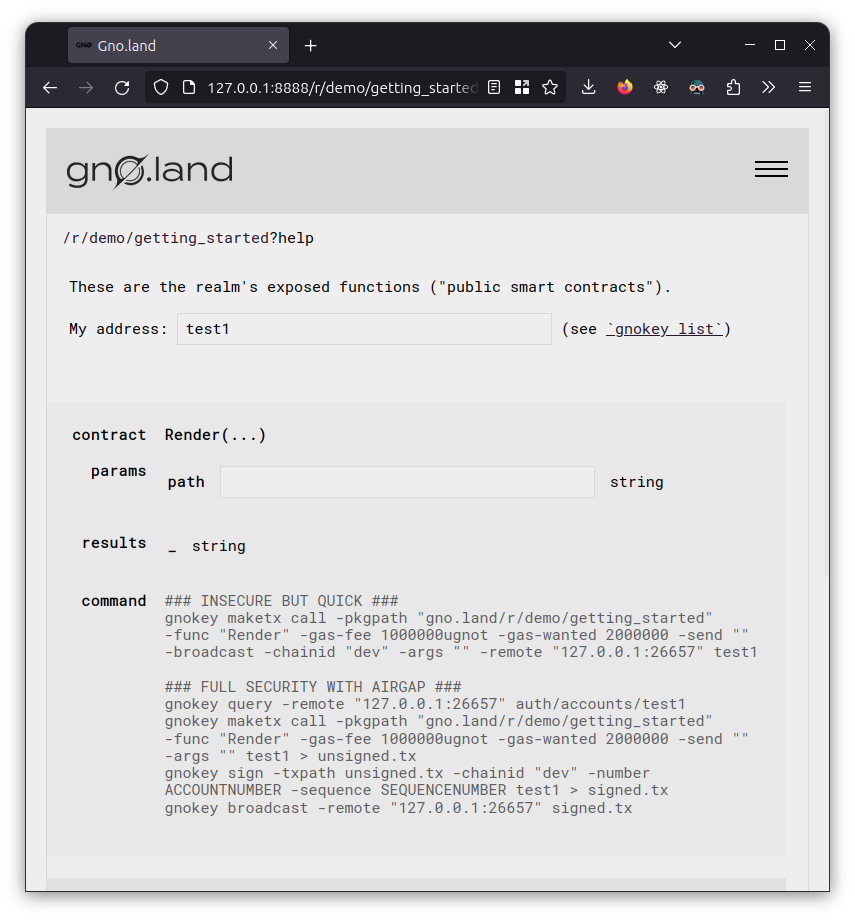

# Getting started

> _Disclaimer: the following tutorial expects you to be running commands within our
> "ready-to-code" Gitpod environment, available from the
> [top-level readme](../../README.md)._

Let's run some basic commands, and set you up with a test key you'll use to do
deployments!

We'll be using two commands in this tutorial, `gno` and `gnokey`.

* `gno` is what we'll use to run and test our Gno programs. It has many
  similar commands to the `go` command, such as `gno doc` and `gno run`.
* `gnokey` is what we'll use to interact with the Gno.land blockchain. We
  automatically set up a local "test node" for you on Gitpod, and gnokey will
  by default try to contact that.

Try the next few commands out!

```console
$ gno --help
USAGE
  <subcommand> [flags] [<arg>...]

Runs the gno development toolkit

SUBCOMMANDS
  mod         Manage gno.mod
  test        Runs the tests for the specified packages
  lint        Runs the linter for the specified packages
  run         Runs the specified gno files
  build       Builds the specified gno package
  precompile  Precompiles .gno files to .go
  clean       Removes generated files and cached data
  repl        Starts a GnoVM REPL
  doc         get documentation for the specified package or symbol (type, function, method, or variable/constant

error parsing commandline arguments: flag: help requested
$ cd tutorial/01_getting_started/
$ gno doc greeter
package greeter // import "gno.land/r/demo/001_getting_started/greeter"

You did it! You're looking at the documentation for greeter.

func Hello(s string) string
$ gno test .
?       ./greeter       [no test files]
--- FAIL: TestRender (0.00s)
output: "hello, mars!" does not contain hello world
./.: test pkg: failed: "TestRender"
FAIL
FAIL    ./.     1.40s
FAIL
FAIL
FAIL: 0 build errors, 1 test errors
```

Oh no! Our tests are failing; it looks like we are greeting the wrong planet.
Let's try to fix that!

## Fixing the test

Inspect the two `.gno` files present in our directory; you'll see that they
implement a function `Render(string) string` and try to test it, verifying that
it contains `hello` and `world`.

Let's try to fix it, shall we?

_For every interactive exercise, we'll be providing with a sample solution to
the problem that we implemented. Don't jump to it straight ahead: we invite you
to try out solving the problem, and opening up the solution if you are stuck or
want to verify yours._

<details>
<summary>Sample solution</summary>

```go
// render.gno
package getting_started

func Render(path string) string {
	return "Hello, world!"
}
```

```console
$ gno test .
?       ./greeter       [no test files]
ok      ./.     1.49s
```

</details>

## Adding a counter

Let's do an exercise to see the power of stateful realms in Gno.

In Gno, we distinguish the equivalent of Go packages between _packages_ and
_realms_. The former behave mostly like their Go counterparts, whereas the
latter have some unique characteristics that distinguish them:

1. Their functions can not only be called outside of other code, but also by
   blockchain end-users as we'll see below.
2. All global variable declarations are persisted outside of the execution of
   the program. Every time a function is called, its state is recovered, and
   then saved from the previous execution.
3. As a consequence of being callable from end users, as well as non-blockchain
   code, our frontend `gnoweb` allows you to view the result of any
   function with signature `func Render(path string) string` as rendered
   markdown.
4. They can still be imported and called normally by other realms, however they cannot be
   called by other packages. Whenever they're imported by other realms, their
   state is still persisted and saved.

<!-- Last point technically not true AFAIK, but the fact it's not the case is a bug. -->

With this in mind, let's change `render.gno` to add a simple "counter":

- Add a global variable declaration for an integer value.
- Add a new exported function `Add`, which increments this integer.
- Write the value of this value when you call `Render`, importing `strconv` and
  using `strconv.Itoa` to convert it to a string.\
  _Note: Gno doesn't currently support reflection, and as such package `fmt`; however, these packages can be used within a testing environment because Gno has temporary support for extra packages (ie, fmt) that are implemented by a ["bridge"](https://github.com/gnolang/gno/blob/cfefb3b223de30a7db8b75c82c9853398caa2983/gnovm/tests/imports.go#L118) between Go and Gno._

<details>
<summary>Sample solution</summary>

```go
// render.gno
package getting_started

import "strconv"

var counter int // realm state

func Render(path string) string {
	return "Counter: " + strconv.Itoa(counter) + "\n\n" +
		"Hello, world!"
}

func Add() {
	counter++
}
```

</details>

## Publishing the realm

As a first step, we'll import the so-called `test1` key into our keychain.

In Gno, every transaction ("stateful operation", so to speak) has to be
performed by a user who is identified through their address. The address comes
as a cryptographic derivative of the user's key.

While you are in a development context like this one, you can jump straight to
importing our predefined key, `test1` which is set up in the default "genesis
block" to contain 10^13 ugnot.

>_ugnot_, where u stands in for µ, is a millionth of Gno.land's native token,
>the $GNOT. ugnot is to gnot what [satoshi](https://www.investopedia.com/terms/s/satoshi.asp)
>is to bitcoin; the smallest, indivisible denomination of the token.

Execute the following command, and input the mnemonic below:

```console
$ gnokey add test1 --recover
```

```
source bonus chronic canvas draft south burst lottery vacant surface solve popular case indicate oppose farm nothing bullet exhibit title speed wink action roast
```

After this, you should have your key set up (with the same address as ours) in
your local keychain.

```console
$ gnokey list

$ gnokey add test1 --recover
Enter a passphrase to encrypt your key to disk:
Repeat the passphrase:
Enter your bip39 mnemonic
source bonus chronic canvas draft south burst lottery vacant surface solve popular case indicate oppose farm nothing bullet exhibit title speed wink action roast

* test1 (local) - addr: g1jg8mtutu9khhfwc4nxmuhcpftf0pajdhfvsqf5 pub: gpub1pgfj7ard9eg82cjtv4u4xetrwqer2dntxyfzxz3pq0skzdkmzu0r9h6gny6eg8c9dc303xrrudee6z4he4y7cs5rnjwmyf40yaj, path: <nil>

$ gnokey list
0. test1 (local) - addr: g1jg8mtutu9khhfwc4nxmuhcpftf0pajdhfvsqf5 pub: gpub1pgfj7ard9eg82cjtv4u4xetrwqer2dntxyfzxz3pq0skzdkmzu0r9h6gny6eg8c9dc303xrrudee6z4he4y7cs5rnjwmyf40yaj, path: <nil>
```

Let's publish our realm; if you are not there already, navigate to this file's
directory and execute the following command:

```console
$ gnokey maketx addpkg \
	--gas-wanted 1000000 \
	--gas-fee 1ugnot \
	--pkgpath gno.land/r/demo/getting_started \
	--pkgdir . \
	--broadcast \
	test1
Enter password.

OK!
GAS WANTED: 1000000
GAS USED:   439393
```

<details>
<summary>Flag breakdown</summary>

* `--gas-wanted`: running smart contracts, as well as publishing packages, will
  typically use a varying number of VM cycles to execute. Here we should
  indicate how many we "expect" to need.\
  The number of VM cycles will be eventually used to calculate, together with
  other factors, how much the caller should "pay" (in terms of `ugnot`) for
  their transaction.
* `--gas-fee`: unused here, but must be non-zero <!-- TODO: improve? -->
* `--pkgpath`: equivalent of Go's import path. Will be used to call our realm,
  as well as by other realms to import us. \
  In Gno, all pkgpaths are prefixed by `gno.land/(p|r)`. Changing the "domain" is
  reserved for future [communication with other blockchains,](https://ibcprotocol.org/)
  while p and r specify whether we're publishing a **p**ackage or a **r**ealm.
* `--pkgdir`: where the package or realm is in our filesystem.
* `--broadcast`: making a transaction could technically be done by creating the
  transaction on one machine, signing it, and then with the signed transaction
  sending it to the chain from another machine. `--broadcast` tells `gnokey` to
  immediately send the transaction after creating it and signing it.

</details>

## Visiting and calling the realm

Try out visiting the realm: use `url` in your shell to get the link to your
gnoweb, then append `/r/demo/getting_started` to the URL.

You should see the output of the `Render()` function, including the value of our
counter set to 0.
Let's try increasing it!

By clicking the `[help]` button in the top right corner, you can visit a page to
list the realm's exposed functions. Every top-level exported function
declaration can be called as a transaction through `gnokey`.

By writing your key name in the `My address:` input, you
can get an auto-generated command to execute the `Add()` transaction on the
chain. Try it out!



Let's try calling `Add()`:

```console
$ gnokey maketx call \
	-pkgpath "gno.land/r/demo/getting_started" \
	-func "Add" \
	-gas-fee 1000000ugnot \
	-gas-wanted 2000000 \
	-send "" -broadcast -chainid "dev" \
	-remote "127.0.0.1:26657" test1
Enter password.

OK!
GAS WANTED: 2000000
GAS USED:   105451
```

If you now try refreshing the first page you loaded, you should see the value of
`Counter` updated to 1.

## Recap

In this section, we learned:

- How to create gno programs with the aid of the `gno` command-line tool.
- How to create a key with `gnokey`, and use it to perform transactions on the
  chain.
- How to publish a realm on the chain, and calling it to increase an integer
  counter.

Next up, we'll be starting out on building our chess server. We'll be
interactively running realms we publish, so make sure to keep the
`gnokey maketx addpkg` command handy.

Note that we currently don't support "updating" a realm. If you wish to iterate
on a realm and publish it again, updated, you should change its path (the author
often uses numerical suffixes, and if using bash, the help of the `$RANDOM`
variable):

```sh
p=gno.land/r/demo/realm_$RANDOM
echo path: $p
gnokey maketx addpkg \
	--gas-wanted 1000000 \
	--gas-fee 1ugnot \
	--pkgpath $p \
	--pkgdir . \
	--broadcast \
	test1
```

## Appendix: Creating your own key

On the production chain, you won't be interacting using the `test1` key (which
exists only for convenience in development contexts), but you will instead use
your own. To generate it, the process is similar to the one above, with the only
difference that you should change the mnemonic for the key, and you may generate
one using `gnokey generate`:

```console
$ gnokey generate
stone wrestle craft chuckle lonely response eternal steak sausage mesh snow steel recycle lounge pizza true trap reject trip spell october panther novel clown
$ gnokey add mykey --recover # ...
```

## Extra: Deterministic time, and qeval

As you may have noticed, there is an additional package within this tutorial's
directory: `greeter`. Let's try to publish it.

```console
$ gnokey maketx addpkg --gas-wanted 1000000 --gas-fee 1ugnot \
	--pkgpath gno.land/r/demo/greeter --pkgdir ./greeter --broadcast test1
Enter password.

OK!
GAS WANTED: 1000000
GAS USED:   371195
```

This realm doesn't have a `Render()` function, so trying to visit on gnoweb
won't work. We can still use it to get to the `[help]` page, but there's a free
way to execute the realm's functions without performing a transaction:

```
$ gnokey query vm/qeval --data 'gno.land/r/demo/greeter'$'\n''Hello("Morgan")'
height: 0
data: ("The time is Thu Sep 21 10:49:06.00000 UTC 2023.\n\nGood morning, Morgan" string)
```

> Note: we use the `$'\n'` syntax in the above example to write a literal newline
> into the `--data` argument. This may not be available in all shells, so if it
> doesn't work for you, we recommend switching to `bash`.

This is what the `gnoweb` frontend uses under the hood to get the data to
display; with the difference that instead of calling `Hello`, it calls `Render`.

As you may have noticed, `vm/qeval` doesn't require us to pass a key, and is
more instantaneous than `gnokey maketx`. This is because it's not actually
performing a transaction, but rather just a simple "query": it's executing the
code with the blockchain's current state, but it's not recording any global
variable modifications into its state. (So if we called the previous `Add`
method using `vm/qeval`, the counter would not be increased).

This is something we're using for the [Gnochess website](https://gnochess.com)
for many places where we don't need to modify the realm's state, but just get
some existing information. In web2 REST terms, you could say we are using `qeval` for
GET requests, and `maketx` for POST requests.

There's one further thing to note: the `Hello` function returns a time, and will
greet you differently on the time of day. An attentive reader might note that
this seems to contradict what we said about determinism: that because blockchain
transactions are to be verified by every node participating in it ("validators"),
then it should not be possible to obtain a measure of the current time, which is
inevitably different with each machine that executes it.

The trick here is that the displayed time is not the system time, but rather the
block time. When you call `time.Now()`, it does not return the system time, but
rather a well-defined variable which is agreed upon by the blockchain validators
before executing the code. This will generally be in increments of N seconds
(our official testnets are configured on a 5 second block time, while for
gnochess it is reduced to 1), which is why the millisecond part in the displayed
time is zero.
